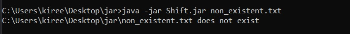
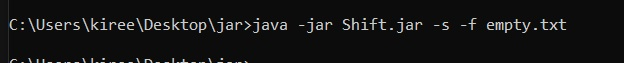
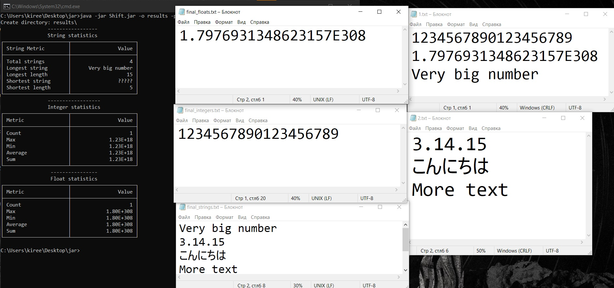
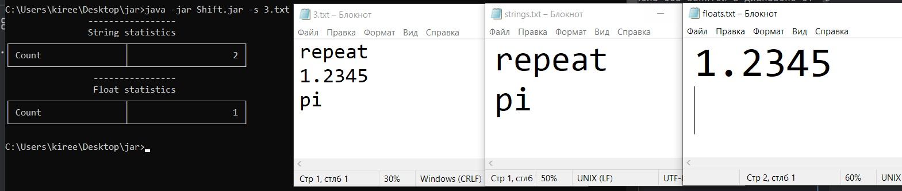
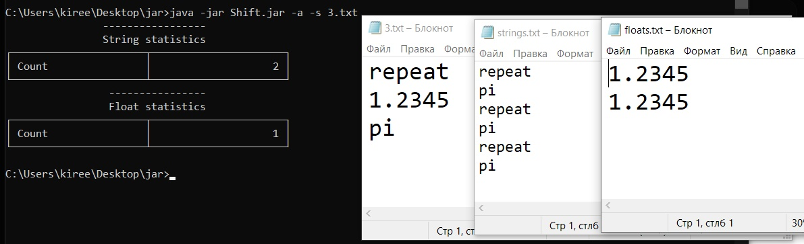
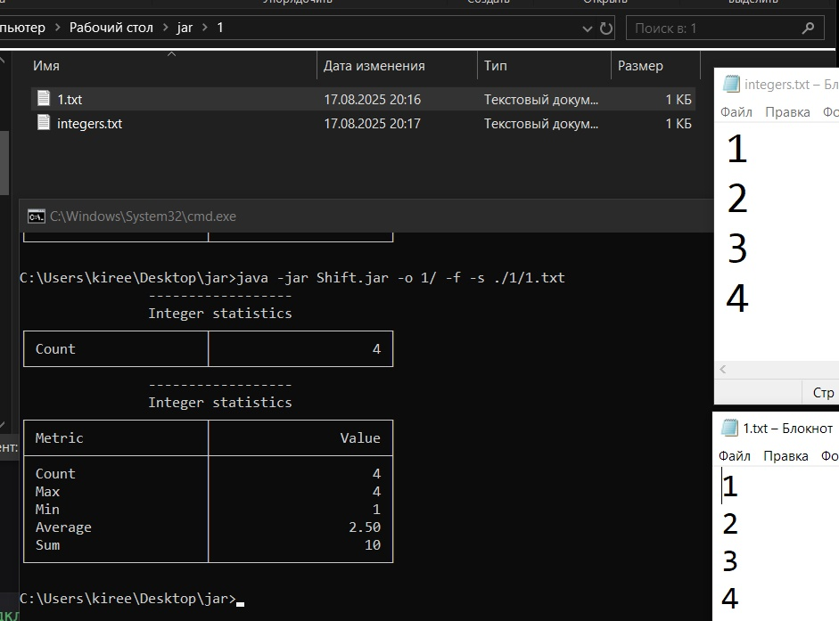

# Тестовое задание
### Создание инструмента для фильтрации данных в файлах по типу данных.

Считывание данных построчно из файлов. Запись каждого значения по их типу Integer, Float, String.   
- `Integer` (все положительные и отрицательные числа без запятой в диапазоне от -2^63 до 2^63-1.    
- `Float` (все положительные и отрицательные числа с запятой или точкой, а также E(e), диапазоне от -2^1024 до 2^1024-1.  
- `String` (все остальные строки).

### Флаги, возможные функции:
- `-o` добавить путь куда будут сохраняться файлы
- `-p` добавляет префикс для вывода файлов
- `-a` режим добавления в существующие файлы (новые данные не будут переписывать старые) 
- `-s` краткая статистика по полученным данным
- `-f` полная статистика по полученным данным

Значения считаются после флага. Все значение в конце считываются как путь до входных данных.


### Устройство кода
Краткое описание классов и работы программы:

`ApplicationOptions`
Обрабатывает аргументы командной строки (-o, -p, -a, -s, -f) и сохраняет настройки. 
Использует JCommander для парсинга.

    <dependency>
        <groupId>org.jcommander</groupId>
             <artifactId>jcommander</artifactId>
        <version>2.0</version>
    </dependency>

`DataType` (enum)
Определяет тип данных (INTEGER, FLOAT, STRING) и проверяет, к какому типу относится строка.

`FileReader`
Читает данные из входных файлов построчно и передаёт их в Statistics и FileWriter.

`FileWriter`
Записывает строки в соответствующие файлы с учётом префикса и режима дописывания.

`Statistics`
Управляет сбором статистики по всем типам данных и выводит её в консоль.

`NumericStatistics` и `StringStatistics`
Считает статистику для чисел и строк.


### Инструкция по запуску
### Необходимое окружение
- Версия Java: 23.0.1.
### Шаги для запуска
1.  **[Скачайте](https://github.com/t2t2t2t/Shift/releases/download/1/Shift.jar)** `Shift.jar`.
2. Откройте командную строку.
3. Из папки с файлом запустите программу с помощью следующей команды:
 ```
 java -jar Shift.jar указать нужные флаги и путь для чтения файлов  
 ```


### Примеры запуска
### Тест 1 
```
java -јаr Shift.jar non-existent.txt
```


- Файл с данными не существует

### Тест 2 
```
java -јаr Shift.jar -s -f empty.txt
```


- Входной файл пустой
### Тест 3
```
java -jar Shift.jar -o results -p final_ -a -f 1.txt C:\Users\kiree\Desktop\test2\2.txt
```


- путь указан относительно текущего расположения .jar
- пути указан абсолютно
- final_ добавились префиксом
- выведена полная статистика

### Тест 4
```
java -jar Shift.jar -s 3.txt
```


```
java -jar Shift.jar -s 3.txt
```


- выведена короткая статистика
- данные были добавлены в существующий файл

### Тест 5

```
java -jar Shift.jar -o 1/ -f -s ./1/1.txt
```

-создан только integers файл
